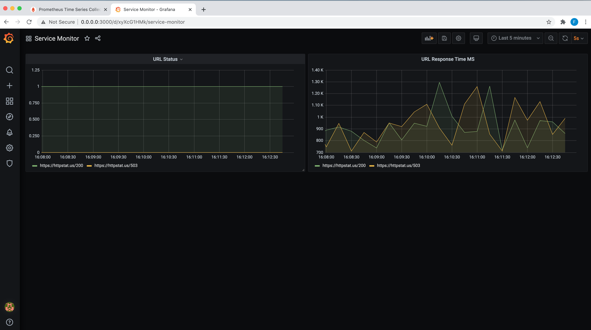
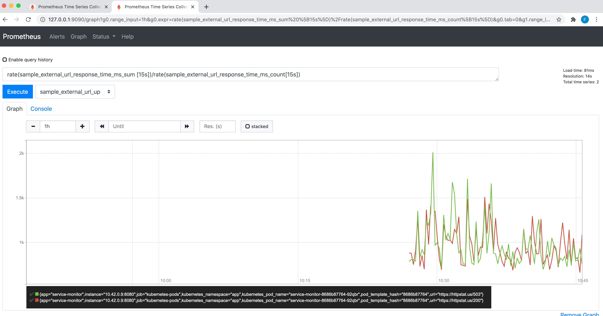
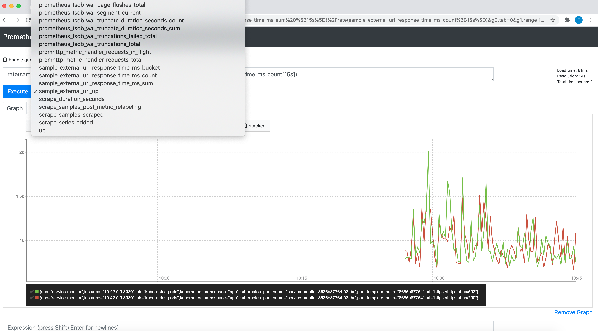

# Scraper 
Scraper is a simple library to scrape and monitor multiple urls and provide prometheus metrics.
### Usecase

```go
package main

import (
	"fmt"
	"log"
	"net/http"
	"net/url"
	"os"
	"strings"
	"time"

	"github.com/arriqaaq/scraper"
	"github.com/gorilla/mux"
)

var (

	// server settings
	port         = 8080
	readTimeout  = 5 * time.Second
	writeTimeout = 5 * time.Second
	// targets to scrape
	targets []*scraper.Target
	// scraper settings
	storeSize = 10
)

// healthzHandler for reporting health
func healthzHandler(w http.ResponseWriter, r *http.Request) {

	switch r.Method {
	case http.MethodGet:
		w.WriteHeader(http.StatusOK)
		w.Write([]byte("OK"))
		break

	default:
		w.WriteHeader(http.StatusMethodNotAllowed)
	}
}

func parseURLs(urls []string) []*scraper.Target {
	var targets []*scraper.Target

	for _, u := range urls {
		u, err := url.ParseRequestURI(u)
		if err != nil {
			continue
		}
		targets = append(targets, scraper.NewTarget(u))
	}
	return targets
}

func main() {

	//Read URLs to monitor from environment variable
	var urls = []string{"http://google.com", "http://cloudflare.com", "http://reddit.com"}

	targets = parseURLs(urls)

	fmt.Printf("URLs to monitor: %+v\n", targets)

	scrapePool, err := scraper.NewScrapePool(
		&scraper.ScrapeConfig{
			ScrapeInterval: time.Duration(3 * time.Second),
			ScrapeTimeout:  time.Duration(2 * time.Second),
			StoreSize:      storeSize,
		},
	)
	if err != nil {
		panic(err)
	}

	scraper.RegisterExporter(scrapePool)

	// start scraping the targets
	scrapePool.Start(targets)

	// create Router
	router := mux.NewRouter()

	// register handlers
	router.Handle("/metrics", scraper.PrometheusHandler())
	router.HandleFunc("/healthz", healthzHandler)

	// configure the HTTP server and start it
	s := &http.Server{
		Addr:           fmt.Sprintf(":%d", port),
		ReadTimeout:    readTimeout,
		WriteTimeout:   writeTimeout,
		MaxHeaderBytes: http.DefaultMaxHeaderBytes,
		Handler:        router,
	}

	log.Fatal(s.ListenAndServe())
}

```
### Metrics Screenshots

  
  
  
